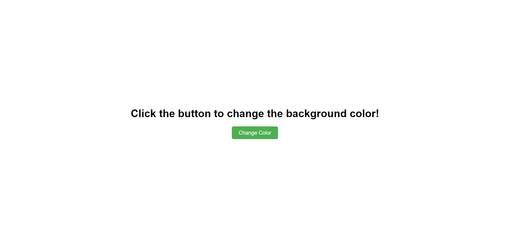
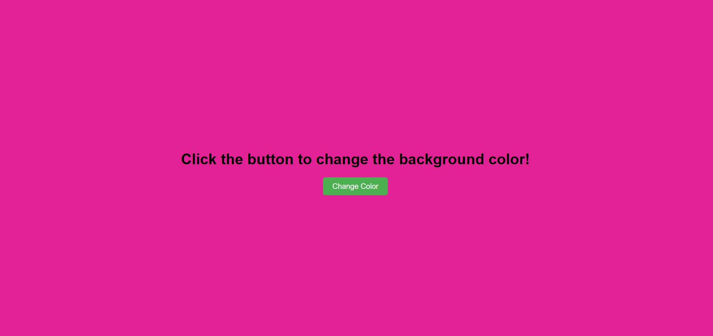

# 🎨 Color Changer

A fun and interactive web project using **HTML**, **CSS**, and **JavaScript** that lets users change the background color of the page by clicking a button. Every click generates a **random vibrant color**, creating a playful and dynamic user experience.

---

## 📸 Preview





---

## ✨ Features

- 🎨 Random background color on every button click
- 🖱️ Simple and intuitive UI
- ⚡ Smooth transition effects
- 📱 Responsive layout (mobile-friendly)

---

## 🛠️ Technologies Used

- HTML5
- CSS3 (Transitions)
- JavaScript (Random color generation)

---

## 🚀 Getting Started

### 1. Clone the repository

```bash
git clone https://github.com/your-username/color-changer.git
cd color-changer
